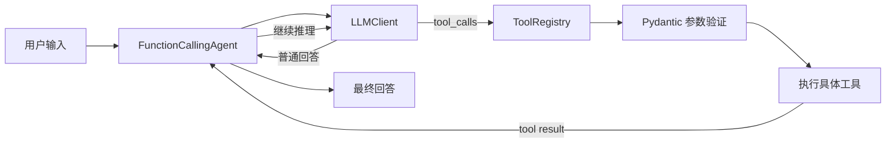

# Agent Toolbox 🤖🧰

一个小而完整的 Python Agent 实验场：模型负责思考，工具负责干活，Pydantic 负责在门口检查参数。

它现在可以处理这样的任务：

> 先计算 25 + 37；如果结果大于 50，再告诉我东京现在几点。

Agent 会自己决定调用顺序：

```text
用户问题
   ↓
LLM 选择 calculator(a=25, b=37)
   ↓
工具返回 62
   ↓
LLM 判断 62 > 50，选择 get_current_time(timezone="Asia/Tokyo")
   ↓
组织最终回答
```

这不是一个庞大的框架，更像一张可以拆装的工作台：代码足够少，适合学习 Agent Loop、Function Calling、工具注册和参数验证是怎样串起来的。

## 已经能做什么

- 调用任意 OpenAI Chat Completions 兼容服务
- 保存对话历史，并按配置限制历史长度
- 支持多轮 Function Calling 和最大执行步数保护
- 使用 Pydantic 同时生成工具 Schema、验证工具参数
- 注册类工具或普通 Python 函数
- 串行编排工具链
- 在线程池中并行执行同步工具
- 通过 `.env` 统一配置模型、温度、最大 token 和历史长度
- 使用纯离线测试验证核心逻辑，不消耗模型额度

项目自带两个示例工具：

| 工具 | 名称 | 能力 |
| --- | --- | --- |
| `CalculatorTool` | `calculator` | 对两个数字做加法 |
| `TimeTool` | `get_current_time` | 获取指定 IANA 时区的当前时间 |

## 工作原理



关键设计只有三层：

1. `LLMClient` 负责和模型服务通信。
2. `FunctionCallingAgent` 负责循环、历史和工具结果回传。
3. `ToolRegistry` 负责找到工具，Pydantic 负责验证参数，工具只处理业务逻辑。

## 快速开始

### 1. 创建虚拟环境

```bash
python3 -m venv .venv
source .venv/bin/activate
```

Windows PowerShell：

```powershell
.venv\Scripts\Activate.ps1
```

### 2. 安装依赖

```bash
python -m pip install openai pydantic python-dotenv
```

### 3. 配置模型服务

复制示例配置：

```bash
cp .env.example .env
```

然后填写 `.env`：

```dotenv
LLM_MODEL=your-model-name
LLM_PROVIDER=openai
LLM_API_KEY=your-api-key
LLM_BASE_URL=https://your-provider.example/v1
LLM_TIMEOUT=60

TEMPERATURE=0.7
MAX_TOKENS=1000
MAX_HISTORY_LENGTH=100
```

`.env` 已被 Git 忽略。不要把真实 API Key 写进 `.env.example` 或提交到仓库。

### 4. 让 Agent 开工

```bash
python main.py
```

默认问题定义在 `main.py` 的 `DEFAULT_QUESTION`，可以直接替换成自己的任务。

## 配置说明

| 环境变量 | 默认值 | 说明 |
| --- | --- | --- |
| `LLM_MODEL` | `gpt-3.5-turbo` | 服务端模型名称 |
| `LLM_PROVIDER` | `openai` | 提供商标识，目前主要用于配置记录 |
| `LLM_API_KEY` | 无 | API 密钥 |
| `LLM_BASE_URL` | 无 | OpenAI 兼容接口地址 |
| `LLM_TIMEOUT` | `60` | 请求超时秒数 |
| `TEMPERATURE` | `0.7` | 模型采样温度 |
| `MAX_TOKENS` | 无 | 单次回答的最大输出 token |
| `MAX_HISTORY_LENGTH` | `100` | Agent 保留的最大消息数量 |
| `DEBUG` | `false` | 调试开关 |
| `LOG_LEVEL` | `INFO` | 日志级别配置 |

同一个 `Config` 实例会交给 LLM 和 Agent。单次 `run()` 参数可以覆盖默认的温度和最大 token：

```python
answer = agent.run(
    "计算 12.5 + 7.5",
    temperature=0.2,
    max_tokens=300
)
```

## 写一个自己的工具

每个类工具都需要一个 Pydantic 参数模型。模型既是给 LLM 看的 JSON Schema，也是工具执行前真正生效的校验器。

```python
from pydantic import BaseModel, ConfigDict, Field

from tools.tool import Tool, ToolResult


class GreetingArguments(BaseModel):
    model_config = ConfigDict(extra="forbid")

    name: str = Field(description="要问候的人")
    excited: bool = Field(default=False, description="是否使用感叹号")


class GreetingTool(Tool[GreetingArguments]):

    def __init__(self):
        super().__init__(
            name="greet",
            description="向指定的人打招呼",
            arguments_model=GreetingArguments
        )

    def run(self, arguments: GreetingArguments) -> ToolResult:
        ending = "！" if arguments.excited else "。"
        return f"你好，{arguments.name}{ending}"
```

注册工具：

```python
registry.register_tool(GreetingTool())
```

之后 `FunctionCallingAgent` 会自动把工具 Schema 交给模型，并在执行前验证参数。缺少字段、类型错误或禁止的额外字段都会产生清晰的 Pydantic 错误。

## 项目结构

```text
agent/
├── main.py                         # 示例入口和 Agent 装配
├── agents/
│   ├── simple_agent.py             # 最小对话 Agent
│   └── function_calling_agent.py   # Function Calling 循环
├── core/
│   ├── agent.py                    # Agent 抽象基类与历史管理
│   ├── config.py                   # 统一配置
│   ├── llm.py                      # OpenAI 兼容客户端
│   └── message.py                  # 消息模型
├── tools/
│   ├── tool.py                     # Tool、ToolCall、ToolRegistry
│   ├── tool_async_executor.py      # 并行工具执行
│   ├── tool_chain_manager.py       # 串行工具链
│   └── tool_list/
│       ├── calculator_tool.py
│       └── time_tool.py
└── tests/                          # 离线单元测试
```

## 运行测试

```bash
python -m unittest discover -s tests -v
```

测试使用模拟 LLM 客户端，不会发送真实 API 请求。目前覆盖：

- Config 环境变量读取
- 历史长度裁剪
- LLM 请求参数组装
- Function Calling 配置传递
- 工具参数验证与 Schema 生成
- 工具并行执行
- 多步骤工具链
- 入口装配

## 接下来可以折腾什么

- 给 `TimeTool` 增加更友好的非法时区提示
- 为 Function Calling Agent 增加完整的模拟 LLM 测试
- 将多个 tool call 接入异步并行执行器
- 用标准 `logging` 替代 `print`
- 增加持久化 Memory、CLI 对话模式或 Web API
- 添加 `pyproject.toml`，把项目变成可安装的软件包

## 一句话总结

> LLM 不必会做所有事情——它只需要知道什么时候该找哪件工具。 ✨
